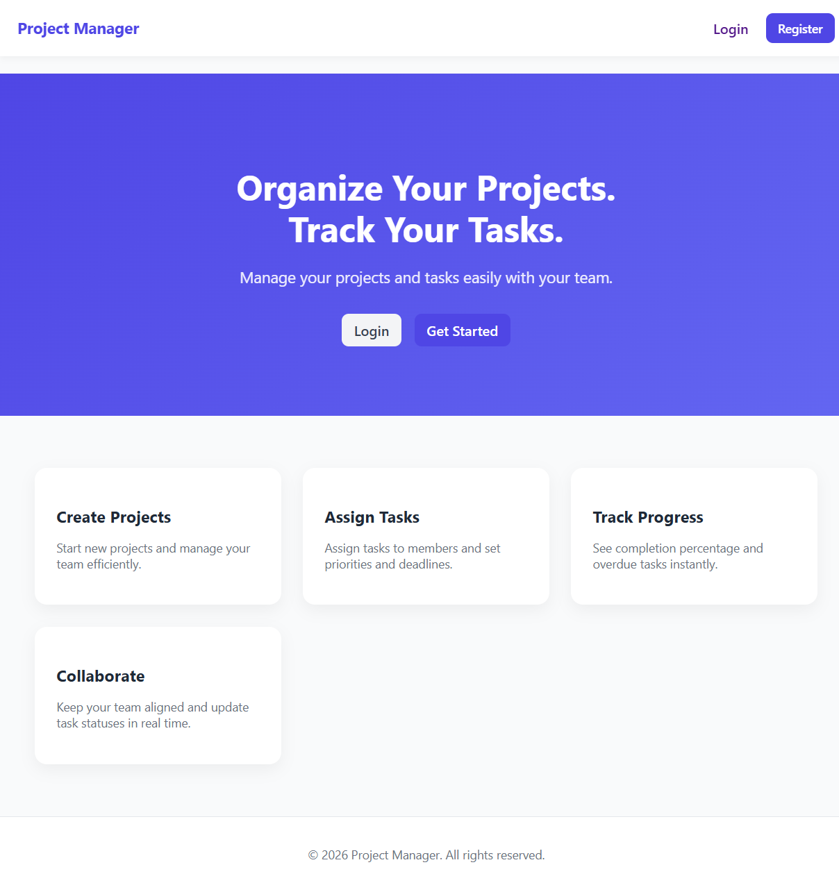
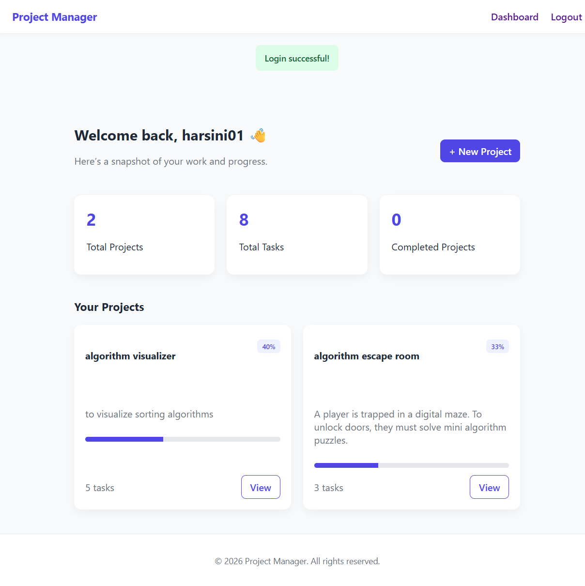
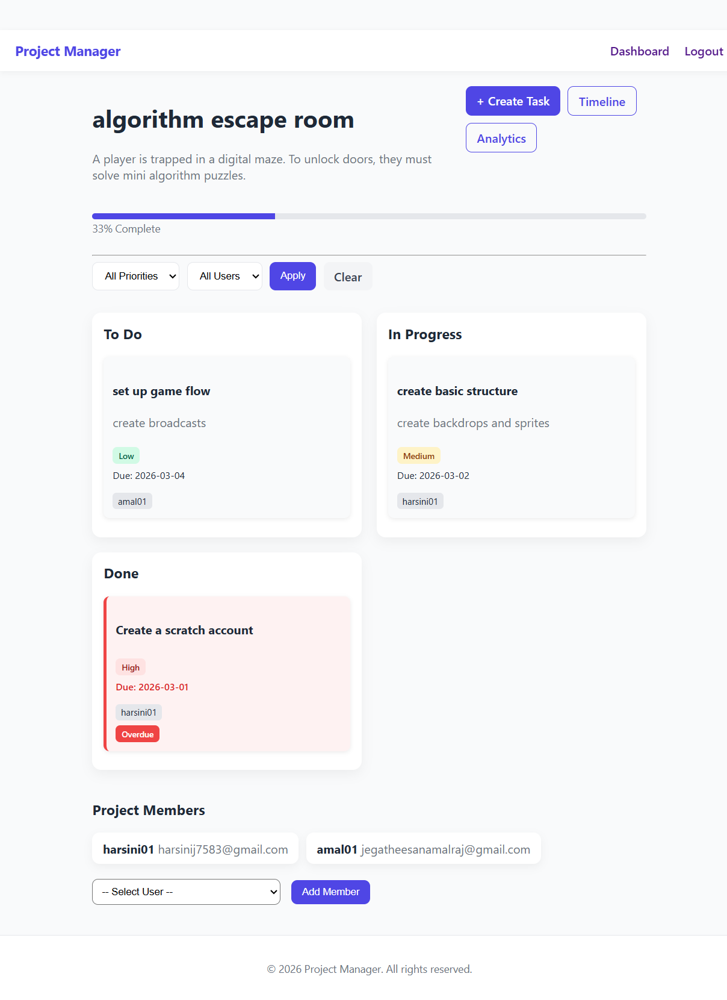
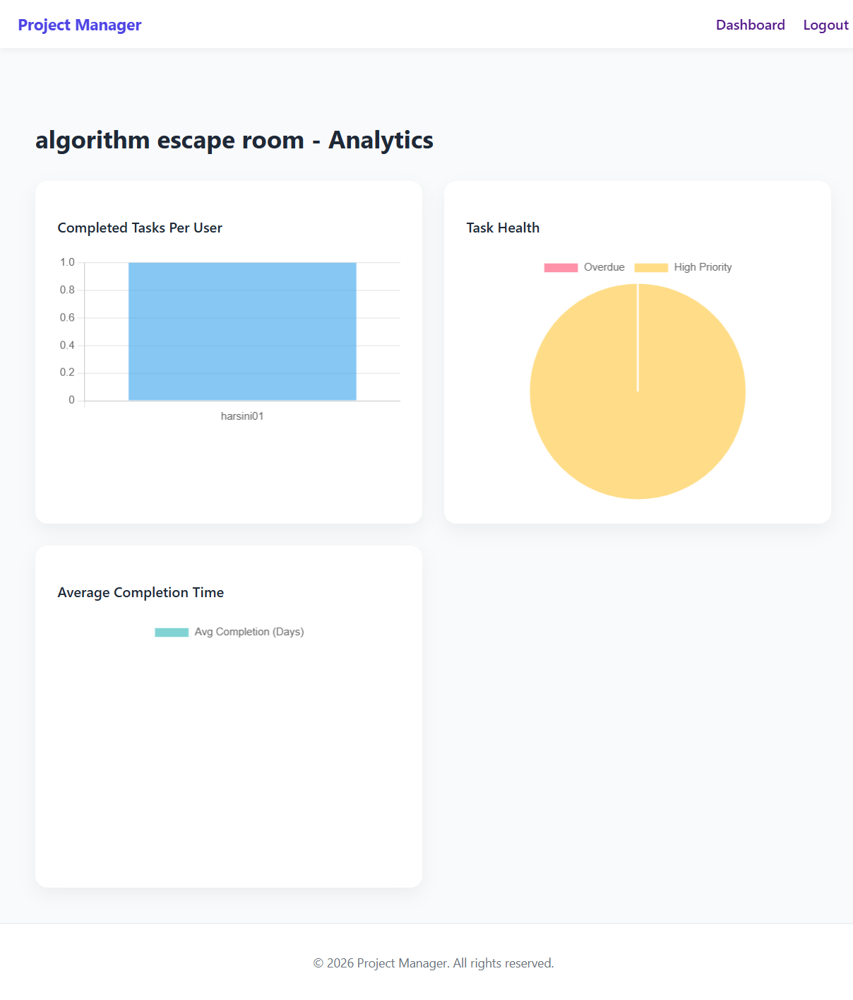
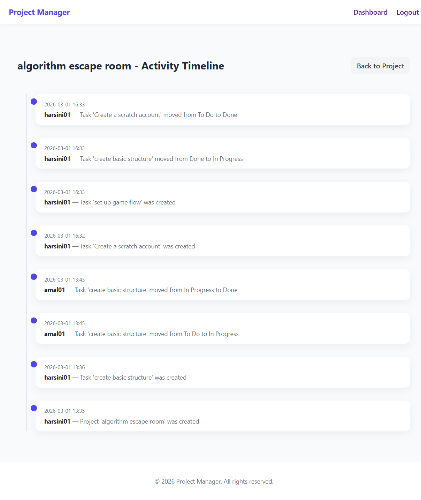

# Project Manager

A full-stack project management web application built with Flask, SQLAlchemy, and JavaScript, featuring Kanban task management, analytics dashboards, and secure authentication.

## Demo Video

[](https://youtu.be/uDy82IiKHOg)

---

## Features
### Authentication & Security

- User registration and login
- Session-based authentication with Flask-Login
- CSRF protection using Flask-WTF
- Secure password hashing

### Project & Task Management

- Create and manage projects
- Assign tasks to users
- Set priorities and due dates
- Track task completion
- Status-based workflow (To Do / In Progress / Done)

### Kanban Board

- Drag-and-drop task movement
- Real-time status updates via fetch() API
- Visual workflow management

### Analytics Dashboard

- Interactive charts powered by Chart.js:
- Completed tasks per user (Bar chart)
- Overdue vs High priority tasks (Pie chart)
- Average completion time (Doughnut chart)

### Modern UI

- Responsive design
- Custom CSS with design variables
- Card-based layout
- Smooth hover animations
- Clean SaaS-inspired interface

---

## Tech Stack
Backend

- Flask
- Flask-SQLAlchemy
- Flask-Login
- Flask-WTF
- SQLite (development database)

Frontend

- HTML5
- CSS3 (custom styling system)
- Vanilla JavaScript
- Chart.js

---

## Installation & Setup

Clone the repository

```bash
git clone https://github.com/harsij01/project-manager.git
cd project-manager
```

Create a virtual environment

```bash
python -m venv venv
source venv/bin/activate   # Mac/Linux
venv\Scripts\activate      # Windows
```

Install dependencies

```bash
pip install -r requirements.txt
```

Set environment variables

```bash
export FLASK_APP=app.py      # Mac/Linux
set FLASK_APP=app.py         # Windows

export FLASK_ENV=development
```

Run the application

```bash
flask run
```

Visit:

```bash
http://127.0.0.1:5000/
```
---

## Database Schema

This application uses **Flask-SQLAlchemy** for ORM-based database management.

The system consists of five main models:

- User
- Project
- Task
- ActivityLog
- Association tables (project_members, task_assignees)

### User

Represents a registered user of the system.

```bash
| Field | Type | Description |
|-------|------|------------|
| id | Integer (PK) | Unique user ID |
| name | String(100) | Unique username |
| email | String(100) | Unique email address |
| role | String(20) | User role (`admin` or `member`) |
| password_hash | String(300) | Hashed password |
```

#### Relationships
- Many-to-many with **Project** (project members)
- Many-to-many with **Task** (task assignees)

### Project

Represents a project containing multiple tasks.

```bash
| Field | Type | Description |
|-------|------|------------|
| id | Integer (PK) | Unique project ID |
| name | String(200) | Project name |
| description | String(300) | Project description |
| created_by | Integer (FK → User.id) | Project creator |
| created_at | DateTime | Creation timestamp |
```

#### Relationships
- Many-to-many with **User** (project members)
- One-to-many with **Task**
- One-to-many with **ActivityLog**

#### Computed Property
- `progress_percentage`  
  Calculates completion percentage based on tasks marked as `"Done"`.

### Task

Represents a task within a project.

```bash
| Field | Type | Description |
|-------|------|------------|
| id | Integer (PK) | Unique task ID |
| name | String(200) | Task title |
| description | Text | Task details |
| created_at | DateTime | Creation timestamp |
| completed_at | DateTime | Completion timestamp |
| priority | String(50) | Task priority |
| status | String(50) | Task status (`To Do`, `In Progress`, `Done`) |
| deadline | DateTime | Due date |
| project_id | Integer (FK → Project.id) | Associated project |
```

#### Relationships
- Belongs to one **Project**
- Many-to-many with **User** (assignees)

#### Computed Property
- `display_status`
  - Returns `"Overdue"` if the deadline has passed and the task is not completed
  - Otherwise returns its current status

### ActivityLog

Tracks actions performed within a project.

```bash
| Field | Type | Description |
|-------|------|------------|
| id | Integer (PK) | Unique log ID |
| action | String(200) | Description of action |
| timestamp | DateTime | When action occurred |
| user_id | Integer (FK → User.id) | Who performed the action |
| project_id | Integer (FK → Project.id) | Related project |
```

#### Relationships
- Belongs to one **User**
- Belongs to one **Project**

### Association Tables

#### project_members
Connects users to projects (many-to-many).

#### task_assignees
Connects users to tasks (many-to-many).

### Relationship Overview

- A **User** can belong to many Projects.
- A **Project** can have many Users.
- A **Project** can have many Tasks.
- A **Task** can have many Users (assignees).
- A **Project** can have many Activity Logs.

### Design Highlights

- Uses cascading deletes (`delete-orphan`) for data integrity.
- Implements computed properties for dynamic data (progress, overdue detection).
- Separates membership and task assignment using association tables.
- Supports role-based access (`admin`, `member`).

---

## Security

- CSRF protection enabled
- Session-based authentication
- Secure form validation
- Protected POST routes

---

## Database Setup

This project uses **Flask** with **SQLAlchemy** for database management. Follow these steps to create and populate the database:

### 1. Create the Database Tables

Run the Python shell or a script to create the tables:

```bash
python3
```
Then in the Python shell:

```bash
from app import app, db

with app.app_context():
    db.create_all()
```
### 2. Create an Admin User

To create an admin user for your application, run the Python shell:

```bash
python3
```

Then in the Python shell:

```bash
from app import app, db
from models import User
from werkzeug.security import generate_password_hash

# Replace values in brackets with your own
admin = User(
    name="[Your Name]",
    email="[your-email@example.com]",
    password_hash=generate_password_hash("[your-password]"),
    role="admin"
)

with app.app_context():
    db.session.add(admin)
    db.session.commit()
```

---

## Screenshots

### Home page


### Dashboard


### Project Details


### Project Analytics


### Project Timeline
